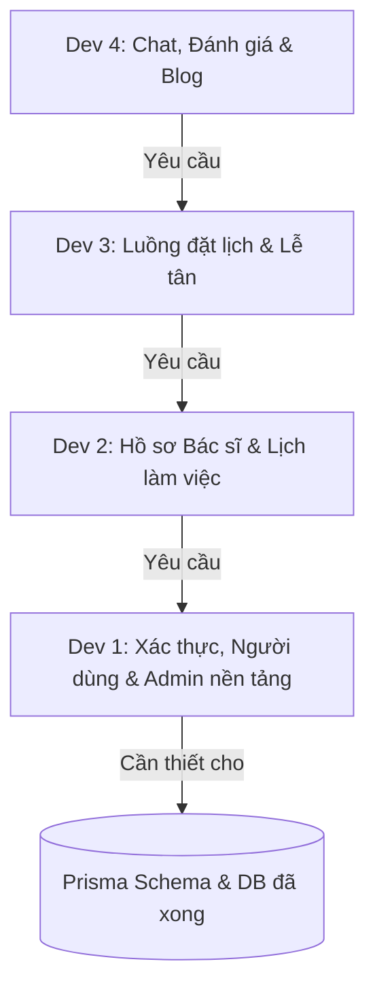

# Kế hoạch phân chia công việc — Hệ thống CarePlus Clinic

Tài liệu này phác thảo việc phân chia công việc giữa **4 Lập trình viên (Developers)** để phát triển Hệ thống Đặt lịch phòng khám CarePlus. Việc phân chia được thiết kế để giảm thiểu xung đột khi merge code (Git conflicts), tuân thủ các quy tắc **Clean Architecture** trong `AGENT.md` và cân bằng khối lượng công việc.

---

## 👥 Ma trận phân chia công việc chính

| Lập trình viên | Lĩnh vực trọng tâm | Các Module nghiệp vụ chính | Phụ thuộc Hạ tầng |
| :--- | :--- | :--- | :--- |
| **Dev 1** | Auth, Profiles & Admin | `auth` (Xác thực), `user` (Người dùng), `patient-profile` (Hồ sơ người thân), `clinic-settings` (Cấu hình) | Redis (token blacklist & rate-limit) |
| **Dev 2** | Lịch làm việc & Doctor Portal | `schedule` (Lịch làm việc), `timeslot` (Ca khám), `doctor` (Bác sĩ), `approval` (Yêu cầu nghỉ) | MySQL Date/Time functions |
| **Dev 3** | Đặt lịch & Receptionist Portal | `appointment` (Lịch hẹn), `notification` (Gửi email) | Nodemailer, Redis (để lock ca khám) |
| **Dev 4** | Chat, Blog & Tìm kiếm | `chat` (Trò chuyện), `review` (Đánh giá), `blog` (Cẩm nang), `upload` (Tải tệp) | Socket.IO, Elasticsearch, Cloudinary |

---

## 📝 Mô tả chi tiết công việc từng Developer

### 👤 Developer 1: Xác thực (Auth), Hồ sơ & Quản trị hệ thống (Admin Portal)
*Trọng tâm: Bảo mật, định danh, quản lý hồ sơ bệnh nhân và cấu hình hệ thống.*

*   **Công việc Backend:**
    *   **Middleware Xác thực:** Thiết lập JWT auth với access token ngắn hạn (15 phút) và refresh token dài hạn (7 ngày) lưu trong httpOnly cookie. Đưa các token bị thu hồi vào blacklist trên Redis.
    *   **APIs Xác thực:** Đăng ký, Đăng nhập, Xác minh Email (OTP), Đặt lại mật khẩu.
    *   **Hồ sơ bệnh nhân & Người thân:** CRUD hồ sơ người thân, xóa mềm qua `isActive: false`, không giới hạn số lượng hồ sơ active theo user trong nghiệp vụ hiện tại.
    *   **Clinic & System Settings:** Cập nhật thông tin phòng khám và cấu hình hệ thống, bao gồm `maxActiveAppointmentsPerUser` để giới hạn số lịch hẹn active theo user. Admin full config dùng `GET/PATCH /api/v1/clinic-settings/system`; public UI đặt lịch chỉ đọc `GET /api/v1/clinic-settings/booking-rules` DTO gọn.
    *   **APIs Admin User Management:** Reset số lần vắng mặt (no-show count), khóa/mở khóa tài khoản đặt lịch online, cập nhật thông tin cơ bản user, tạo tài khoản nhân sự.
    *   **Lưu ý business:** Hệ thống không dùng hồ sơ mặc định trong flow đặt lịch hiện tại; nếu route set default còn tồn tại thì không expose frontend.
*   **Công việc Frontend:**
    *   **Trang xác thực:** Đăng nhập, Đăng ký, Xác minh Email, Quên mật khẩu.
    *   **Patient Portal:** Trang chỉnh sửa thông tin cá nhân, đổi mật khẩu, upload avatar, quản lý hồ sơ người thân (thêm/sửa/xóa mềm người thân, chỉ hiển thị tổng số hồ sơ active, không có UI đặt mặc định).
    *   **Admin Portal:** Admin Dashboard (các thẻ số liệu KPI), Quản lý người dùng (list/search/filter/pagination, chi tiết, sửa, tạo staff, khóa/mở khóa, reset no-show), Quản lý chuyên khoa, Thông tin phòng khám và Cấu hình hệ thống.

---

### 🩺 Developer 2: Lịch làm việc & Doctor Portal
*Trọng tâm: Lịch làm việc của bác sĩ, quản lý ca khám và yêu cầu nghỉ phép.*

*   **Công việc Backend:**
    *   **APIs Hồ sơ Bác sĩ:** Xem chi tiết hồ sơ, cấu hình giá khám tham khảo, tính toán điểm đánh giá (rating) trung bình.
    *   **Sinh lịch làm việc:** Tạo các ca khám 30 phút (`08:00–11:30` và `13:30–17:00`) cho bác sĩ theo ngày cụ thể. Đảm bảo ràng buộc duy nhất `(doctorId, workingDate)` trong database.
    *   **Yêu cầu nghỉ (Doctor Leave):** Tạo yêu cầu nghỉ phép (loại `SCHEDULE_EXCEPTION`). Tự động khóa các ca khám (TimeSlots) trong khoảng thời gian chờ duyệt.
    *   **APIs Doctor Dashboard:** Thống kê KPI ngày hôm nay và danh sách timeline lịch hẹn trong ngày.
*   **Công việc Frontend:**
    *   **Doctor Portal Dashboard:** Các thẻ KPI và Dòng thời gian lịch hẹn trong ngày (Today's Timeline).
    *   **Quản lý lịch làm việc:** Giao diện lịch biểu theo Tuần/Tháng hiển thị trạng thái ca làm việc được phân biệt bằng màu sắc (`Làm việc` = cyan nhạt, `Nghỉ đã duyệt` = đỏ nhạt, `Chờ duyệt` = vàng nhạt).
    *   **Modal Yêu cầu nghỉ:** Form gửi yêu cầu nghỉ (Cả ngày, Theo ca, hoặc Theo khoảng giờ) kèm lý do và validation hợp lệ.
    *   **Trang thông tin cá nhân bác sĩ:** Chỉnh sửa thông tin học vị, kinh nghiệm, giới thiệu; hiển thị readonly email và chuyên khoa.

---

### 📅 Developer 3: Luồng đặt lịch & Receptionist Portal
*Trọng tâm: Nghiệp vụ đặt lịch hẹn của bệnh nhân, lễ tân và xử lý trạng thái lịch khám.*

*   **Công việc Backend:**
    *   **Engine Đặt lịch (Booking):** Tạo lịch hẹn với các quy tắc chống spam nghiêm ngặt:
        *   Kiểm tra email của bệnh nhân đã xác minh và tài khoản không bị khóa (vắng mặt $\ge 3$ lần).
        *   Mỗi người khám chỉ được đặt tối đa 1 lịch hẹn hoạt động trong ngày và 1 lịch hẹn hoạt động với cùng một bác sĩ.
        *   Tích hợp Redis lock slot (`lock:slot:{slotId}`) với TTL 5 phút khi bệnh nhân bắt đầu chọn slot ở Bước 2 của Booking Wizard.
        *   Sử dụng Prisma Transaction để đảm bảo tính toàn vẹn (tạo lịch hẹn + chuyển trạng thái `TimeSlot` sang `BOOKED` + sinh mã lịch hẹn `CP` + 10 chữ số).
        *   Lưu snapshot của `consultationFee` (giá khám tham khảo) và `patientEmail` tại thời điểm đặt.
    *   **Cập nhật trạng thái lịch hẹn:** Check-in, Hoàn thành, Hủy lịch (kiểm tra hạn hủy trước 2 giờ/1 ngày), và vắng mặt (No-show).
    *   **APIs Lễ tân:** Tra cứu bệnh nhân bằng SĐT/Email/Tên, đặt lịch khám hộ bệnh nhân, check-in nhanh, và xem lịch làm việc của bác sĩ.
    *   **Tích hợp Nodemailer:** Tự động gửi email xác minh tài khoản, xác nhận đặt lịch thành công, thông báo hủy lịch, hoặc cảnh báo khóa tài khoản do no-show.
*   **Công việc Frontend:**
    *   **Bộ công cụ Đặt lịch (Patient Booking Wizard):** 5 bước đặt lịch (Chuyên khoa -> Bác sĩ & Lịch -> Thông tin người khám -> Xác nhận -> Hoàn tất).
    *   **Receptionist Portal:** Dashboard lễ tân, danh sách lịch hẹn hôm nay, bộ đặt lịch khám hộ bệnh nhân, Drawer thao tác nhanh (Check-in, báo vắng mặt, hủy lịch, hoàn thành).
    *   **Trang lịch hẹn của tôi (Patient):** Bộ lọc theo trạng thái, nút hủy lịch (chỉ hiển thị nếu còn $\ge 1$ ngày trước ngày khám), và nút Đánh giá bác sĩ (chỉ hiển thị khi đã hoàn thành khám).

---

### 💬 Developer 4: Chat, Blog, Đánh giá & Hạ tầng Tìm kiếm/Hình ảnh
*Trọng tâm: Giao tiếp thời gian thực, quản lý nội dung cẩm nang y khoa, đánh giá của bệnh nhân và tích hợp bên thứ ba.*

*   **Công việc Backend:**
    *   **Real-time Socket.IO:** Cấu trúc các room socket (`user:{userId}`, `conversation:{conversationId}`, `role:admin`), xử lý sự kiện realtime (`chat:message-received`, `chat:typing`, `notification:new`).
    *   **APIs Chat:** Danh sách hội thoại, tin nhắn phân trang, gửi tin nhắn (loại `TEXT` hoặc `FILE`).
    *   **APIs Đánh giá (Reviews):** Gửi đánh giá & số sao (1-5 sao, 10-1000 ký tự). Ràng buộc: chỉ đánh giá 1 lần duy nhất cho mỗi lịch hẹn có trạng thái `COMPLETED`. Tự động cập nhật điểm trung bình của bác sĩ.
    *   **APIs Blog:** CRUD bài viết cẩm nang sức khỏe (Trạng thái: `DRAFT`, `PUBLISHED`, `ARCHIVED`).
    *   **Tìm kiếm (Elasticsearch):** Cấu hình chỉ mục (index) và đồng bộ dữ liệu tự động cho Bác sĩ, Chuyên khoa, Bài viết. Endpoint tìm kiếm chung (Search bar).
    *   **Lưu trữ hình ảnh (Cloudinary):** Tải lên và dọn dẹp ảnh đại diện người dùng, ảnh bài viết cẩm nang.
*   **Công việc Frontend:**
    *   **Public Website:** Trang chủ (Tìm kiếm nhanh chuyên khoa/bác sĩ, danh sách chuyên khoa, slider bác sĩ được yêu thích/kinh nghiệm, cẩm nang sức khỏe mới nhất), Chi tiết chuyên khoa, Chi tiết bác sĩ.
    *   **Giao diện Chat:** Widget chat nổi góc dưới màn hình (đối với bệnh nhân/khách) và trang nhắn tin chuyên dụng (đối với bác sĩ và lễ tân).
    *   **Trang đánh giá:** Hiển thị tổng quan điểm đánh giá và danh sách đánh giá của bác sĩ (lazy load 5 bài một lần). Giao diện gửi đánh giá.
    *   **Quản lý Blog:** CRUD bài viết cho Admin (viết bằng markdown, upload thumbnail, xuất bản bài viết).

---

## 🔄 Trình tự tích hợp & Sự phụ thuộc giữa các Dev

Để quá trình phát triển không bị nghẽn (block), các lập trình viên nên phối hợp theo thứ tự phụ thuộc sau:

1.  **Giai đoạn 1:** **Dev 1** tập trung hoàn thành tầng Auth và API người dùng trước để các Dev khác lấy dữ liệu User và phân quyền (RBAC).
2.  **Giai đoạn 2:** **Dev 2** xây dựng APIs Lịch làm việc và Ca khám dựa trên thông tin bác sĩ.
3.  **Giai đoạn 3:** **Dev 3** hiện thực hóa nghiệp vụ Đặt lịch (kết nối giữa User của **Dev 1** và ca khám của **Dev 2**).
4.  **Giai đoạn 4:** **Dev 4** triển khai chat thời gian thực và đánh giá (dựa trên các lịch hẹn đã khám xong từ **Dev 3**).
