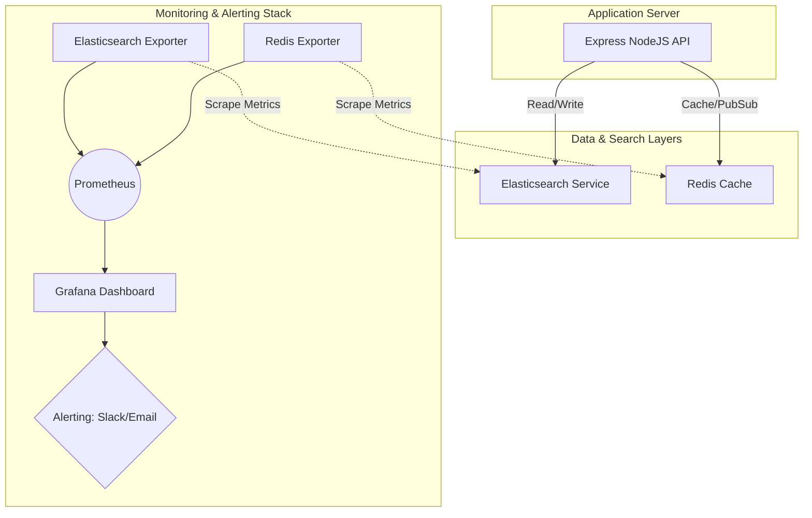

# Hướng dẫn Quản lý và Giám sát (Monitoring) Elasticsearch & Redis

Tài liệu này cung cấp hướng dẫn chi tiết từ cơ bản đến nâng cao để quản lý, theo dõi sức khỏe (health checking), và giám sát hiệu năng của **Elasticsearch** và **Redis** trong dự án **CarePlus Clinic**.

---

## 🐋 1. Quản lý bằng Docker Compose (Môi trường Development)

Vì cả hai dịch vụ đều được chạy bằng Docker Compose trong dự án CarePlus, bước đầu tiên để quản lý và theo dõi chúng là sử dụng các lệnh Docker:

### Các câu lệnh cơ bản:
*   **Kiểm tra trạng thái các container:**
    ```bash
    docker-compose ps
    ```
    *Xem các container có đang chạy bình thường không (`Up`), cổng (ports) nào đang được map.*

*   **Xem logs thời gian thực:**
    ```bash
    # Xem logs của cả 2 dịch vụ
    docker-compose logs -f elasticsearch redis
    
    # Chỉ xem logs của Elasticsearch
    docker-compose logs -f elasticsearch
    
    # Chỉ xem logs của Redis
    docker-compose logs -f redis
    ```

*   **Kiểm tra tài nguyên sử dụng (CPU, RAM):**
    ```bash
    docker stats careplus-elasticsearch careplus-redis
    ```
    *Rất hữu ích vì Elasticsearch thường ngốn rất nhiều RAM (được cấu hình giới hạn `-Xms512m -Xmx512m` trong `docker-compose.yml`).*

---

## 🔴 2. Quản lý và Giám sát Redis

Redis là một kho lưu trữ dữ liệu dạng key-value hoạt động trên RAM (in-memory). Để giám sát Redis, bạn có hai lựa chọn chính: **CLI (Dòng lệnh)** và **GUI (Giao diện trực quan)**.

### 2.1 Sử dụng Redis CLI (Dòng lệnh)
Bạn có thể trực tiếp đi vào container Redis để chạy các lệnh quản trị:

```bash
docker exec -it careplus-redis redis-cli
```

Một số lệnh giám sát quan trọng khi đã kết nối vào `redis-cli`:

| Lệnh | Chức năng | 💡 Tác dụng |
| :--- | :--- | :--- |
| `PING` | Trả về `PONG` | Kiểm tra kết nối nhanh xem Redis có phản hồi không. |
| `INFO` | Hiển thị toàn bộ thông tin hệ thống | Xem chi tiết về Memory sử dụng (`used_memory_human`), CPU, số lượng kết nối (`connected_clients`), số lượng keys,... |
| `INFO memory` | Chỉ xem thông tin bộ nhớ | Kiểm tra xem cache có đang bị đầy RAM hay không. |
| `DBSIZE` | Xem tổng số lượng key | Biết được hiện tại đang có bao nhiêu key trong database. |
| `MONITOR` | Theo dõi tất cả các câu lệnh realtime | **Cực kỳ hữu ích khi debug!** Nó sẽ in ra mọi lệnh mà Backend gửi tới Redis (GET, SET, EXPIRE,...) ngay lập tức. |
| `SLOWLOG GET 10` | Lấy ra 10 lệnh chạy chậm nhất | Dùng để tìm ra các query làm chậm hệ thống Redis. |
| `CLIENT LIST` | Liệt kê các client đang kết nối | Xem có bao nhiêu ứng dụng hoặc kết nối đang trỏ vào Redis. |

> [!WARNING]
> Tránh chạy lệnh `KEYS *` trên môi trường Production vì nó là lệnh synchronous và sẽ lock Redis nếu số lượng key quá lớn. Thay vào đó, hãy dùng `SCAN`.

---

### 2.2 Sử dụng Công cụ Giao diện (GUI)
Để dễ dàng xem cấu trúc Key, Value, và theo dõi trực quan hơn, bạn nên sử dụng:

1. **Redis Insight (Khuyên dùng - Chính chủ của Redis)**
   * **Giới thiệu**: Đây là GUI tốt nhất hiện tại cho Redis, hoàn toàn miễn phí, giao diện hiện đại và trực quan.
   * **Cách dùng**: Tải về cài đặt trên máy cá nhân, sau đó cấu hình kết nối:
     * **Host**: `localhost` (hoặc IP của server docker)
     * **Port**: `6379`
   * **Tính năng**: Cho phép duyệt key theo dạng cây, chạy CLI tích hợp, phân tích dung lượng RAM, theo dõi slowlog và giám sát các chỉ số kết nối theo thời gian thực (Real-time charts).
   
2. **Another Redis Desktop Manager**
   * Một ứng dụng GUI mã nguồn mở, rất nhẹ và nhanh, hỗ trợ cả Redis Sentinel và Cluster.

---

## 🔍 3. Quản lý và Giám sát Elasticsearch

Elasticsearch chạy trên cổng `9200` và cung cấp một hệ thống REST API rất mạnh mẽ để chúng ta truy vấn thông tin trạng thái trực tiếp.

### 3.1 Sử dụng Elasticsearch REST API (CLI / Postman / Browser)
Bạn có thể dùng `curl` hoặc các công cụ gửi HTTP Request để gọi các Endpoint giám sát (được gọi là **Cat APIs**):

*   **Kiểm tra Sức khỏe Cluster (Cluster Health):**
    ```bash
    curl -X GET "http://localhost:9200/_cluster/health?pretty"
    ```
    *Kết quả trả về trạng thái màu sắc:*
    *   🟢 **Green**: Mọi thứ hoạt động hoàn hảo (primary shards và replica shards đều chạy tốt).
    *   🟡 **Yellow**: Tất cả primary shards hoạt động, nhưng một số replica shards chưa được phân bổ (thường xảy ra ở môi trường local chạy `single-node` vì không có node thứ 2 để chứa bản sao).
    *   🔴 **Red**: Một số primary shards không hoạt động, dữ liệu bị mất một phần hoặc toàn bộ.

*   **Xem danh sách các Node:**
    ```bash
    curl -X GET "http://localhost:9200/_cat/nodes?v&pretty"
    ```
    *Xem thông số CPU, RAM sử dụng của từng Node trong Cluster.*

*   **Xem danh sách tất cả các Index (Bảng dữ liệu):**
    ```bash
    curl -X GET "http://localhost:9200/_cat/indices?v&pretty"
    ```
    *Kiểm tra kích thước Index, số lượng tài liệu (`docs.count`), trạng thái sức khỏe của từng index.*

*   **Kiểm tra mapping của index (Cấu trúc trường dữ liệu):**
    ```bash
    curl -X GET "http://localhost:9200/appointments/_mapping?pretty"
    ```
    *Kiểm tra xem các trường (fields) trong index `appointments` hoặc `doctors` đã được định nghĩa đúng kiểu dữ liệu (text, keyword, date, integer...) chưa.*

---

### 3.2 Sử dụng Công cụ Giao diện (GUI)

1. **Elasticvue (Khuyên dùng - Rất nhanh & tiện lợi)**
   * **Dưới dạng Browser Extension**: Có sẵn trên Chrome Web Store / Firefox Add-ons.
   * **Cách dùng**: Sau khi cài đặt extension, bạn chỉ cần mở nó ra và điền địa chỉ kết nối `http://localhost:9200`.
   * **Tính năng**: Cho phép tìm kiếm dữ liệu trực tiếp, xem/sửa cấu trúc Mapping, tạo/xóa index, và hiển thị biểu đồ sức khỏe của cluster một cách trực quan mà không cần viết code.

2. **Kibana (Chính chủ Elastic - Phù hợp dự án lớn)**
   * **Giới thiệu**: Kibana là một phần của bộ ba ELK Stack, cung cấp công cụ trực quan hóa dữ liệu và quản lý cluster Elasticsearch cực kỳ mạnh mẽ.
   * **Cài đặt nhanh qua Docker**: Bạn có thể thêm dịch vụ Kibana vào `docker-compose.yml` như sau:
     ```yaml
     kibana:
       image: docker.elastic.co/kibana/kibana:8.11.3
       container_name: careplus-kibana
       restart: always
       ports:
         - "5601:5601"
       environment:
         - ELASTICSEARCH_HOSTS=http://elasticsearch:9200
       depends_on:
         - elasticsearch
     ```
     *Sau khi chạy `docker-compose up -d`, truy cập `http://localhost:5601` để sử dụng.*

---

## 🛠️ 4. Tích hợp Health Check tự động vào Source Code (Express Backend)

Để hệ thống tự động theo dõi trạng thái của Redis và Elasticsearch, chúng ta nên viết mã nguồn kiểm tra sức khỏe (Health Check) trong ứng dụng Express. Điều này giúp các hệ thống Cloud (như AWS Route 53, Kubernetes Liveness/Readiness Probe, hoặc các công cụ Uptime Monitor) biết được khi nào dự án CarePlus đang gặp sự cố kết nối.

Hãy cải tiến endpoint `/health` tại [app.js](file:///home/tcb/Documents/MTSE/CarePlus/backend/src/app.js) để kiểm tra trạng thái thực tế:

```javascript
const redis = require('./infrastructure/cache/redis.client');
const elasticClient = require('./infrastructure/search/elastic.client');

app.get('/health', async (req, res) => {
  const healthDetails = {
    uptime: process.uptime(),
    timestamp: new Date(),
    services: {
      database: 'unknown',
      redis: 'unknown',
      elasticsearch: 'unknown'
    }
  };

  let isHealthy = true;

  // 1. Kiểm tra Redis
  try {
    const pingResponse = await redis.ping();
    if (pingResponse === 'PONG') {
      healthDetails.services.redis = 'healthy';
    } else {
      healthDetails.services.redis = 'unhealthy';
      isHealthy = false;
    }
  } catch (error) {
    healthDetails.services.redis = `error: ${error.message}`;
    isHealthy = false;
  }

  // 2. Kiểm tra Elasticsearch
  try {
    const esPing = await elasticClient.ping();
    if (esPing) {
      healthDetails.services.elasticsearch = 'healthy';
    } else {
      healthDetails.services.elasticsearch = 'unhealthy';
      isHealthy = false;
    }
  } catch (error) {
    healthDetails.services.elasticsearch = `error: ${error.message}`;
    isHealthy = false;
  }

  // 3. Kiểm tra Database (Prisma)
  try {
    const prismaClient = require('./infrastructure/database/prisma.client');
    await prismaClient.$queryRaw`SELECT 1`;
    healthDetails.services.database = 'healthy';
  } catch (error) {
    healthDetails.services.database = `error: ${error.message}`;
    isHealthy = false;
  }

  // Phản hồi HTTP Status Code tương ứng
  if (isHealthy) {
    return res.status(200).json({
      success: true,
      message: 'CarePlus API and all services are healthy',
      details: healthDetails
    });
  } else {
    return res.status(503).json({
      success: false,
      message: 'One or more services are down',
      details: healthDetails
    });
  }
});
```

---

## 📈 5. Mô hình Giám sát Nâng cao (Cho Môi trường Production)

Khi đưa ứng dụng lên Production (UAT/Live), bạn cần thiết lập hệ thống giám sát tập trung chủ động thay vì kiểm tra thủ công:



### Các công cụ giám sát khuyên dùng trên Production:
1.  **Prometheus + Grafana + Exporters:**
    *   Sử dụng **Redis Exporter** (OLIVER006) để đẩy metrics Redis lên Prometheus.
    *   Sử dụng **Elasticsearch Exporter** để đẩy metrics cluster lên Prometheus.
    *   Tạo Dashboard tuyệt đẹp trên Grafana để theo dõi RAM, CPU, I/O và thiết lập cảnh báo tự động về Telegram/Slack nếu RAM/Disk đạt ngưỡng 85%.
2.  **Datadog / New Relic / Elastic APM:**
    *   Các giải pháp Agent All-in-One trả phí. Bạn chỉ cần cài đặt Agent lên máy chủ, nó sẽ tự động phát hiện Elasticsearch & Redis và vẽ sơ đồ mối tương quan hiệu năng rất chi tiết.
